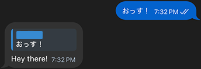

# Telegram DeepL Bot

A Telegram bot that translates messages using DeepL API. Also supports translating messages in group chats.

## 💬 How it works

Add this bot to your group and it will translate all messages into a language you selected using /lang command (the default one is English). You can also just forward the message you want to translate directly to the bot. Use /list command to get a list of all the available languages. In group chats only admins can use the /lang command.

👉 [Try it on Telegram](https://t.me/neko_whisper_bot)



## 📦 Setup

### Requirements

- Python 3.13+
- Poetry installed (https://python-poetry.org/)

### 1. Clone

```shell
git clone https://github.com/yourname/deepl-bot.git
cd deepl-bot
```

### 2. Install deps

```shell
poetry install
```

### 3. Environment

Create `.env` file:

```dotenv
# Telegram Bot Token (from @BotFather)
BOT_TOKEN=

# DeepL API Token (https://www.deepl.com/en/your-account/keys)
DEEPL_TOKEN=

# Path to SQLite DB file
SQLITE_PATH=
```

### 4. Run

```shell
poetry run python -m deepl_bot.run
```

### 🐳 Docker (optional)

```shell
docker compose up
```
